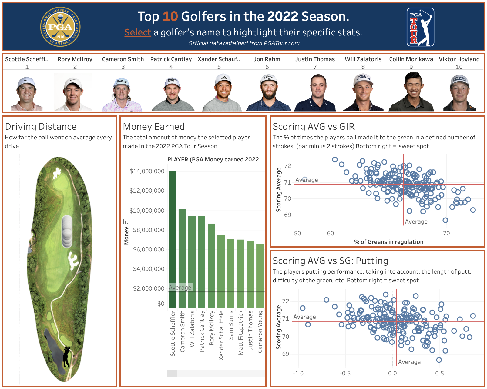

# 🏌️‍♂️ Top 10 PGA Tour Golfers – 2022 Season Dashboard

This interactive Tableau dashboard visualizes performance metrics of the **Top 10 PGA Tour golfers** from the 2022 season. Users can select a golfer to explore individual statistics like driving distance, money earned, and scoring efficiency.

## 🔗 Live Dashboard

👉 [View the dashboard on Tableau Public](https://public.tableau.com/views/Top10PGAGolfers2022/Top10PGAGolfers2022?:language=en-US&:sid=&:redirect=auth&:display_count=n&:origin=viz_share_link)

## 📊 Dashboard Highlights

- **Driving Distance:** Average yardage off the tee
- **Money Earned:** Total earnings in the 2022 season
- **Scoring Average vs. GIR:** Shows efficiency in reaching the green
- **Scoring Average vs. SG: Putting:** Analyzes putting skill compared to peers

The scatter plots are centered around average performance — golfers in the **bottom-right quadrant** of both charts are outperforming in efficiency.

## 📁 Project Structure

- `data/`: CSV data files used for dashboard creation
- `images/dashboard-preview.png`: Dashboard screenshot
- `README.md`: Project overview

## 📂 Data Files

The following CSV files were used to power the Tableau dashboard (stored in the `/data` folder):

- `Driving_Distance.csv`
- `PGA_Money_earned_2022.csv`
- `GIR_percentage.csv`
- `Scoring_Average.csv`
- `SG_Putting.csv`
- `PGA_2022_World_Ranking.csv`

> Source: Official data from [PGATour.com](https://www.pgatour.com/stats)

## 🖼️ Preview

---

> Built using **Tableau Desktop** as part of a coursework project at Utah State University.
